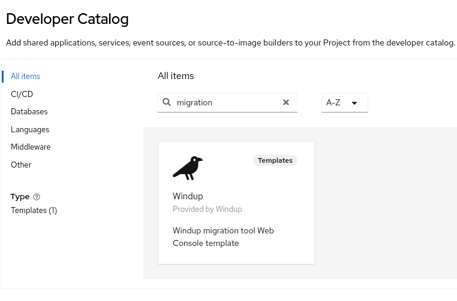

# windup-openshift: Migration Toolkit for Applications on OpenShift
This project is useful if you want to try WINDUP on an OpenShift instance.  
If you just want to test WINDUP using the [images](https://quay.io/organization/windupeng) we have made available in the quay.io repository, go straight to the [OpenShift template deployment](#openshift-template-deployment) section.  
If you have made some changes to WINDUP and you want to test them on an OpenShift instance, in the next paragraph you'll find all the information for building your own container images so that you're free to test your code.  
There's also the case that you don't have an OpenShift instance available and, in this scenario, Red Hat Container Development Kit can help you working locally on your machine with any need for an OpenShift instance to test your changes to the code. In this case please follow the instructions in the [Working with Red Hat Container Development Kit](#working-with-red-hat-container-development-kit) section.

## OpenShift image construction
### Install Docker
For building this project and creating Docker images you have to have a Docker instance running locally on your machine so that you can pull the built images.  
Next you'll find some basic instructions to install Docker based on your local OS.
#### Install Docker for Fedora
1. Install Docker: `$ sudo dnf install docker`
1. Configure `docker` group (ref. [Manage Docker as a non-root user](https://docs.docker.com/install/linux/linux-postinstall/#manage-docker-as-a-non-root-user)):
   1. `$ sudo groupadd docker`
   1. `$ sudo usermod -aG docker $USER`
   1. Log out and log back in so that your group membership is re-evaluated
1. Test Docker is working: `$ docker run hello-world`

For any issue related to installation, you can refer to [Docker documentation](https://docs.docker.com/install/linux/docker-ce/fedora/).
#### Install Docker for other OS
For any other platform you can follow the detailed instructions provided in the [Install Docker](https://docs.docker.com/install/) guide from Docker.
### Create an account for Quay.io
You need an account on https://quay.io/ in order to push your images and have them available for deployment from the OCP templates.  
So sign up yourself to Quay.io at https://quay.io/signin/ taking care that the Quay username you choose will be the `<your_quay_id>` value in the next steps.

### Create a token on registry.redhat.io (only once)
1. Login on https://access.redhat.com/login
2. Go to [Registry Service accounts](https://access.redhat.com/terms-based-registry/)
3. Create a New Service Account if you don't have one
4. Click on the service account and go to "Docker Login" tab.
5. Copy the bash command
6. Paste that command in a shell window on your local machine and execute it
7. Now your local Docker installation will have the credentials in ~/.docker/config.json

### Create Docker images
1. Build this project: `$ mvn clean install -Ddocker.name.windup.web=<your_quay_id>/windup-web-openshift -Ddocker.name.windup.web.executor=<your_quay_id>/windup-web-openshift-messaging-executor`
1. Push images to docker hub:
   1. `$ docker login`
   1. `$ docker push <your_quay_id>/windup-web-openshift`
   1. `$ docker push <your_quay_id>/windup-web-openshift-messaging-executor`

If you want you can also set the tag for the built images (e.g. if you are working on a specific branch and you want to create images tagged with the branch name), you just have to add the tag name to the `docker.name.windup.web` and `docker.name.windup.web.executor` system properties' values (i.e. from the above example `-Ddocker.name.windup.web=<your_quay_id>/windup-web-openshift:tag_value -Ddocker.name.windup.web.executor=<your_quay_id>/windup-web-openshift-messaging-executor:tag_value`)

### Point to your images
Now that your images are available on Quay.io repository, you have to reference them in WINDUP template in order to use these images in the deployments.
1. open [`./templates/src/main/resources/web-template-empty-dir-executor.json`](templates/src/main/resources/web-template-empty-dir-executor.json) in an IDE or text editor
1. change all the `"image"` values to point to `quay.io/<your_quay_id>/` instead of `quay.io/windupeng/`
   
## OpenShift template deployment
There are two different ways for deploying WINDUP on OpenShift based upon if you have [`cluster-admin privileges`](https://docs.openshift.org/latest/architecture/additional_concepts/authorization.html#roles): if you have those privileges you can decide to follow [Template deployment in OpenShift catalog](#template-deployment-in-openshift-catalog) (because you can operate on the default `openshift` project) or [Import template in Openshift Web Console](#import-template-in-openshift-web-console) otherwise you can just go with the latter approach ([Import template in Openshift Web Console](#import-template-in-openshift-web-console))

### Choose the template
There are different templates available to be imported in your OpenShift instance.
The table below summarizes the different use cases for each template

| Template | Requirements | Description                                                                                                                                                 |
| --- | --- |-------------------------------------------------------------------------------------------------------------------------------------------------------------|
| [`web-template-empty-dir-executor.json`](templates/src/main/resources/web-template-empty-dir-executor.json) | OpenShift | The recommended template to deploy WINDUP on OCP The analysis data between the `executor` pod and the `web console` one are sent using REST web services |
| [`web-template-empty-dir-executor-shared-storage.json`](templates/src/main/resources/web-template-empty-dir-executor-shared-storage.json) | OpenShift with `ReadWriteMany (RWX)` storage| This template deploys WINDUP on OCP using a shared storage between the `executor` pod and the `web console` one to share the analysis data                  |

### Template deployment in OpenShift catalog
1. login to Openshift: `$ oc login`
1. create the template: `$ oc create -f ./templates/src/main/resources/web-template-empty-dir-executor.json -n openshift`

Now, if you go to OpenShift Web Console home page, you'll see  Windup (ref. *screenshot-0*) in the list of the available templates and so you can deploy it to a project just like any other template.

*screenshot-0: in OpenShift Web Console (v4.10) `Browse Catalog` page you can see the `Windup` icon (bottom row, 3rd column)*
### Import template in Openshift Web Console
1. copy the raw content of file [web-template-empty-dir-executor.json](templates/src/main/resources/web-template-empty-dir-executor.json)
1. paste it in the "Import YAML / JSON" wizard in Openshift Web Console (ref. *screenshot-1*)
1. save and wait for the deployment to end

*screenshot-1: in OpenShift Web Console (v4.10) `Import YAML / JSON` wizard you can paste template raw content*
